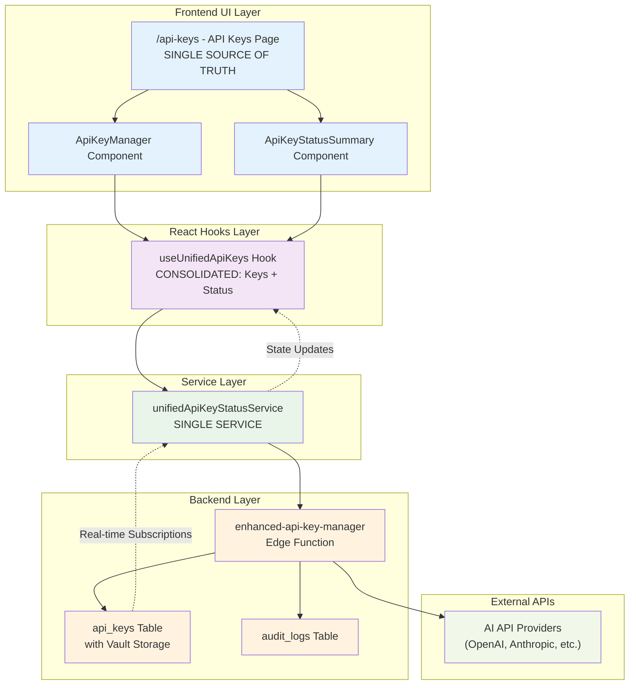

# API Key Management Architecture

## Simplified Flow Overview

This document outlines the simplified, consolidated API key management architecture that serves as the single source of truth for all API key operations.

## Architecture Diagram



## Data Flow Explanation

### 1. Frontend Layer
- **`/api-keys` Page**: Single source of truth for API key management UI
- **ApiKeyManager**: Handles CRUD operations for API keys
- **ApiKeyStatusSummary**: Displays real-time status and validation results

### 2. Hooks Layer
- **useUnifiedApiKeys**: Consolidated hook that manages both API keys and their status
  - Replaces multiple separate hooks
  - Provides unified state management
  - Handles real-time subscriptions

### 3. Service Layer
- **unifiedApiKeyStatusService**: Single service for all API key operations
  - Vault encryption/decryption
  - Status validation
  - Real-time updates
  - Cache management

### 4. Backend Layer
- **enhanced-api-key-manager**: Edge function that handles:
  - Secure vault operations
  - External API validation
  - Database operations
  - Audit logging
- **api_keys Table**: Stores encrypted keys with vault references
- **audit_logs Table**: Tracks all operations for security

### 5. External APIs
- **AI Providers**: Various AI services for validation and testing

## Key Features

### Security
- **Vault Encryption**: All API keys stored using Supabase Vault with AES-256
- **No Plaintext Storage**: Keys never stored in plaintext in database
- **Masked Display**: Only prefix/suffix shown in UI
- **Audit Trail**: All operations logged

### Real-time Features
- **Live Status Updates**: Automatic status refresh via WebSocket subscriptions
- **Instant Validation**: Real-time API key testing
- **Status Propagation**: Changes automatically update across all components

### Performance
- **Unified Caching**: Single cache layer for both keys and status
- **Batch Operations**: Efficient bulk operations
- **Optimized Queries**: Minimal database calls

## Simplifications Made

### Removed Components
- ❌ `useUnifiedApiKeyStatus` hook → ✅ Merged into `useUnifiedApiKeys`
- ❌ `apiKeyService` legacy service → ✅ Direct use of `unifiedApiKeyStatusService`
- ❌ Multiple context providers → ✅ Simplified state management

### Consolidated Responsibilities
- **Single Hook**: `useUnifiedApiKeys` handles both keys and status
- **Single Service**: `unifiedApiKeyStatusService` manages all operations
- **Single UI Source**: `/api-keys` page is the authoritative interface

## Usage Examples

### Basic API Key Management
```typescript
const { 
  apiKeys, 
  statuses, 
  saveApiKey, 
  deleteApiKey, 
  validateApiKey 
} = useUnifiedApiKeys();

// Save a new API key
await saveApiKey('openai', 'sk-...');

// Check status
if (statuses.openai?.isWorking) {
  // API key is working
}
```

### Status Monitoring
```typescript
const { workingApis, hasWorkingApis } = useUnifiedApiKeys();

if (hasWorkingApis) {
  console.log('Working APIs:', workingApis);
}
```

## Benefits

1. **Reduced Complexity**: Single path for all operations
2. **Better Performance**: Fewer network calls, unified caching
3. **Easier Maintenance**: One service to update
4. **Type Consistency**: Unified type definitions
5. **Real-time Updates**: Single subscription system
6. **Security**: Centralized vault management