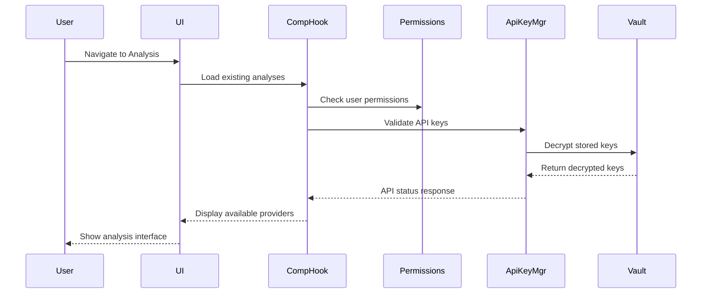
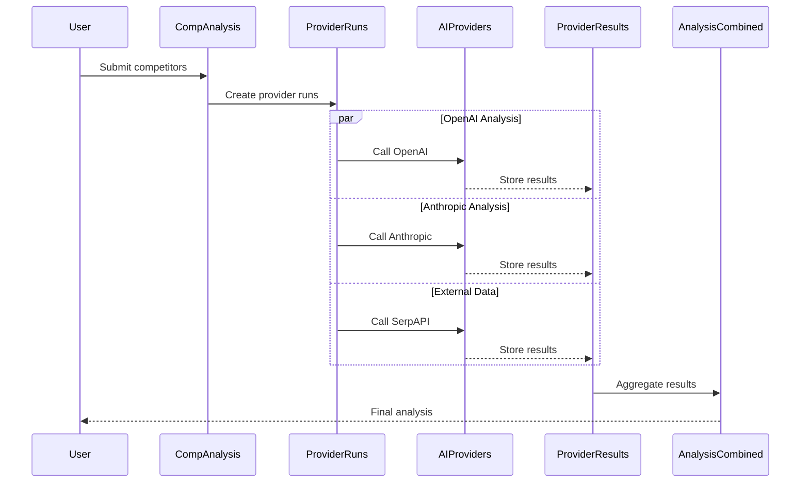

# Competitor Analysis System - Complete Architecture

## System Overview
This diagram represents the complete end-to-end competitor analysis system as currently implemented, including all database tables, edge functions, API integrations, and data flows.

## Comprehensive System Architecture

```mermaid
graph TB
    subgraph "User Interface Layer"
        UI["/competitor-analysis Dashboard"]
        CompForm["Competitor Input Form"]
        Progress["Real-time Progress Display"]
        Results["Analysis Results Viewer"]
        Export["Export Interface"]
        Settings["API Keys Settings"]
    end

    subgraph "Frontend State Management"
        CompHook["useUnifiedCompetitorAnalysis"]
        ApiHook["useUnifiedApiKeys"]
        ProgressHook["useAnalysisProgress"]
        ExportHook["useAnalysisExport"]
    end

    subgraph "Supabase Edge Functions"
        ApiKeyMgr["enhanced-api-key-manager"]
        CompAnalysis["competitor-analysis"]
        CompProfile["analyze-company-profile"]
        Permissions["check-analysis-permissions"]
        ExportFunc["analysis-export"]
        DebugFlow["debug-competitor-flow"]
    end

    subgraph "AI Provider Integration"
        OpenAI["OpenAI GPT-4"]
        Anthropic["Claude"]
        Gemini["Google Gemini"]
        Perplexity["Perplexity"]
        Groq["Groq"]
        Mistral["Mistral"]
        Cohere["Cohere"]
        HuggingFace["Hugging Face"]
    end

    subgraph "External Data Sources"
        SerpAPI["SerpAPI - Search Results"]
        NewsAPI["NewsAPI - News Data"]
        AlphaVantage["Alpha Vantage - Financial"]
        WebScraping["Web Scraping Services"]
    end

    subgraph "Core Database Tables"
        ApiKeys["api_keys<br/>- Encrypted API keys<br/>- Vault storage<br/>- Provider validation"]
        CompetitorAnalyses["competitor_analyses<br/>- Main analysis records<br/>- Status tracking<br/>- User ownership"]
        CompanyProfiles["company_profiles<br/>- Company data<br/>- Profile enrichment<br/>- Metadata storage"]
    end

    subgraph "Analysis Execution Tables"
        AnalysisRuns["analysis_runs<br/>- Session management<br/>- Run coordination<br/>- Status tracking"]
        ProviderRuns["analysis_provider_runs<br/>- Individual AI calls<br/>- Cost tracking<br/>- Performance metrics"]
        ProviderResults["analysis_provider_results<br/>- Raw AI responses<br/>- Normalized data<br/>- Quality scores"]
        AnalysisCombined["analysis_combined<br/>- Aggregated results<br/>- Confidence scoring<br/>- Final output"]
    end

    subgraph "Supporting Tables"
        DrillDown["ai_drill_down_sessions<br/>- Deep dive analysis<br/>- Follow-up queries<br/>- Specialized insights"]
        AuditLogs["audit_logs<br/>- All user actions<br/>- System events<br/>- Security tracking"]
        PromptLogs["ai_prompt_logs<br/>- AI interactions<br/>- Prompt tracking<br/>- Response logging"]
        UsageCosts["api_usage_costs<br/>- Cost tracking<br/>- Usage metrics<br/>- Billing data"]
        BusinessInsights["business_insights<br/>- Generated insights<br/>- Action items<br/>- Impact analysis"]
    end

    subgraph "Real-time & Progress Tables"
        ProgressTable["competitor_analysis_progress<br/>- Live progress updates<br/>- Status broadcasting<br/>- Error handling"]
        Metrics["api_metrics<br/>- Performance data<br/>- Response times<br/>- Success rates"]
    end

    subgraph "Security & Access Control"
        Vault["Supabase Vault<br/>- Encrypted storage<br/>- Secret management<br/>- Key rotation"]
        RLS["Row Level Security<br/>- User isolation<br/>- Permission enforcement<br/>- Data protection"]
        AdminUsers["admin_users<br/>- Admin access<br/>- Role management<br/>- System oversight"]
    end

    %% User Interaction Flow
    UI --> CompForm
    UI --> Progress
    UI --> Results
    UI --> Export
    UI --> Settings
    
    %% Frontend to Backend
    CompForm --> CompHook
    Progress --> ProgressHook
    Results --> CompHook
    Export --> ExportHook
    Settings --> ApiHook
    
    %% Hook to Edge Functions
    CompHook --> CompAnalysis
    CompHook --> CompProfile
    ApiHook --> ApiKeyMgr
    ProgressHook --> CompAnalysis
    ExportHook --> ExportFunc
    
    %% Edge Function Coordination
    CompAnalysis --> Permissions
    CompAnalysis --> DebugFlow
    CompProfile --> CompAnalysis
    ApiKeyMgr --> Vault
    
    %% Edge Functions to AI Providers
    CompAnalysis --> OpenAI
    CompAnalysis --> Anthropic
    CompAnalysis --> Gemini
    CompAnalysis --> Perplexity
    CompAnalysis --> Groq
    CompAnalysis --> Mistral
    CompAnalysis --> Cohere
    CompAnalysis --> HuggingFace
    
    %% Edge Functions to External Data
    CompAnalysis --> SerpAPI
    CompAnalysis --> NewsAPI
    CompAnalysis --> AlphaVantage
    CompAnalysis --> WebScraping
    
    %% Database Write Operations
    ApiKeyMgr --> ApiKeys
    CompAnalysis --> CompetitorAnalyses
    CompAnalysis --> AnalysisRuns
    CompAnalysis --> ProviderRuns
    CompAnalysis --> ProviderResults
    CompAnalysis --> AnalysisCombined
    CompAnalysis --> ProgressTable
    CompProfile --> CompanyProfiles
    CompAnalysis --> DrillDown
    
    %% Audit and Logging
    ApiKeyMgr --> AuditLogs
    CompAnalysis --> PromptLogs
    CompAnalysis --> UsageCosts
    CompAnalysis --> Metrics
    CompAnalysis --> BusinessInsights
    
    %% Security Integration
    ApiKeys --> Vault
    CompetitorAnalyses --> RLS
    CompanyProfiles --> RLS
    AnalysisRuns --> RLS
    
    %% Real-time Updates
    ProgressTable -.->|Real-time| Progress
    ProviderRuns -.->|Live Status| Progress
    AnalysisCombined -.->|Results| Results
    
    %% Data Flow Relationships
    CompetitorAnalyses --> AnalysisRuns
    AnalysisRuns --> ProviderRuns
    ProviderRuns --> ProviderResults
    ProviderResults --> AnalysisCombined
    AnalysisCombined --> BusinessInsights
    CompetitorAnalyses --> DrillDown
    
    %% Admin Oversight
    AdminUsers --> AuditLogs
    AdminUsers --> UsageCosts
    AdminUsers --> ApiKeys
    
    %% Styling
    classDef ui fill:#e3f2fd,stroke:#1976d2,stroke-width:2px
    classDef hooks fill:#f3e5f5,stroke:#7b1fa2,stroke-width:2px
    classDef functions fill:#e8f5e8,stroke:#388e3c,stroke-width:2px
    classDef ai fill:#fff3e0,stroke:#f57c00,stroke-width:2px
    classDef external fill:#f1f8e9,stroke:#689f38,stroke-width:2px
    classDef database fill:#fce4ec,stroke:#c2185b,stroke-width:2px
    classDef security fill:#ffebee,stroke:#d32f2f,stroke-width:2px
    classDef realtime fill:#e0f2f1,stroke:#00796b,stroke-width:2px
    
    class UI,CompForm,Progress,Results,Export,Settings ui
    class CompHook,ApiHook,ProgressHook,ExportHook hooks
    class ApiKeyMgr,CompAnalysis,CompProfile,Permissions,ExportFunc,DebugFlow functions
    class OpenAI,Anthropic,Gemini,Perplexity,Groq,Mistral,Cohere,HuggingFace ai
    class SerpAPI,NewsAPI,AlphaVantage,WebScraping external
    class ApiKeys,CompetitorAnalyses,CompanyProfiles,AnalysisRuns,ProviderRuns,ProviderResults,AnalysisCombined,DrillDown,AuditLogs,PromptLogs,UsageCosts,BusinessInsights database
    class Vault,RLS,AdminUsers security
    class ProgressTable,Metrics realtime
```

## Analysis Flow Details

### 1. Initialization Phase

### 2. Analysis Execution Phase

## Key Features

### Multi-Provider AI Analysis
- **8 AI Providers**: OpenAI, Anthropic, Gemini, Perplexity, Groq, Mistral, Cohere, HuggingFace
- **External Data Sources**: SerpAPI, NewsAPI, Alpha Vantage
- **Parallel Processing**: Simultaneous calls to multiple providers
- **Result Aggregation**: Intelligent combination of multiple AI responses

### Real-time Progress Tracking
- **Live Updates**: WebSocket-based progress broadcasting
- **Provider Status**: Individual provider call status
- **Error Handling**: Graceful failure handling and retry logic
- **Progress Indicators**: Percentage completion and current step

### Comprehensive Data Management
- **13 Core Tables**: Complete data persistence and relationships
- **Audit Trail**: Full logging of all user actions and system events
- **Cost Tracking**: Detailed usage and billing information
- **Performance Metrics**: Response times and success rates

### Security & Access Control
- **Vault Encryption**: Supabase Vault for API key storage
- **Row Level Security**: User data isolation
- **Admin Controls**: Comprehensive admin oversight
- **Audit Logging**: Security event tracking

### Export & Insights
- **Multiple Formats**: PDF, Excel, JSON export options
- **Business Insights**: AI-generated actionable insights
- **Drill-down Analysis**: Deep-dive capabilities for specific areas
- **Historical Tracking**: Analysis history and comparisons

## Current System Capabilities

✅ **Operational Features:**
- Multi-provider competitor analysis
- Real-time progress tracking
- Secure API key management
- Comprehensive data export
- Admin dashboard and oversight
- Cost tracking and billing
- Performance monitoring
- Audit trail and logging

🔧 **Technical Infrastructure:**
- Supabase backend with 30+ tables
- 6 specialized edge functions
- Real-time subscriptions
- Vault-encrypted storage
- Row-level security
- Multi-provider AI integration
- External data source integration

📊 **Analytics & Insights:**
- Business insight generation
- Performance metrics
- Usage analytics
- Cost optimization
- Quality scoring
- Confidence metrics