# AI-Powered SaaS Platform - System Architecture & User Flows

This document outlines the complete system architecture, user flows, and data flows for the AI-powered entrepreneurship platform.

## Table of Contents
1. [System Overview](#system-overview)
2. [User Authentication Flow](#user-authentication-flow)
3. [API Key Management Flow](#api-key-management-flow)
4. [AI Chat System Flow](#ai-chat-system-flow)
5. [Competitor Analysis Flow](#competitor-analysis-flow)
6. [Geographic Analysis Flow](#geographic-analysis-flow)
7. [Admin Management Flow](#admin-management-flow)
8. [Data Architecture](#data-architecture)
9. [Edge Function Architecture](#edge-function-architecture)
10. [Security & Monitoring Flow](#security--monitoring-flow)

## System Overview

```mermaid
graph TB
    User[👤 User] --> Frontend[🌐 React Frontend]
    Admin[👑 Admin] --> AdminPanel[🔧 Admin Panel]
    
    Frontend --> Auth[🔐 Supabase Auth]
    Frontend --> API[📡 Supabase Client]
    
    API --> EdgeFunctions[⚡ Edge Functions]
    API --> Database[(🗄️ PostgreSQL)]
    API --> Storage[📁 Supabase Storage]
    
    EdgeFunctions --> OpenAI[🤖 OpenAI API]
    EdgeFunctions --> Anthropic[🧠 Anthropic API]
    EdgeFunctions --> Gemini[💎 Google Gemini]
    EdgeFunctions --> Perplexity[🔍 Perplexity API]
    
    Database --> Vault[🔒 Supabase Vault]
    
    EdgeFunctions --> Database
    EdgeFunctions --> Logging[📊 Analytics & Logs]
    
    style Frontend fill:#e1f5fe
    style EdgeFunctions fill:#fff3e0
    style Database fill:#f3e5f5
    style Vault fill:#ffebee
```



## User Authentication Flow


## API Key Management Flow

```mermaid
flowchart TD
    A[User visits API Keys page] --> B[Check existing keys]
    B --> C{Has API Keys?}
    
    C -->|No| D[Show "Add API Key" button]
    C -->|Yes| E[Display key list with status]
    
    D --> F[User clicks "Add API Key"]
    F --> G[Select Provider]
    G --> H[Enter API Key]
    H --> I[Click Save]
    
    I --> J[Frontend validation]
    J --> K{Valid format?}
    K -->|No| L[Show format error]
    K -->|Yes| M[Call enhanced-api-key-manager]
    
    M --> N[Edge Function Processing]
    N --> O[Validate key format]
    O --> P[Test API connection with timeout]
    P --> Q{API responds?}
    
    Q -->|No| R[Return validation error]
    Q -->|Yes| S[Store in Supabase Vault]
    S --> T[Create masked version]
    T --> U[Save to api_keys table]
    U --> V[Return success]
    
    V --> W[Update UI with new key]
    R --> X[Show error message]
    L --> H
    X --> H
    
    E --> Y[Key actions available]
    Y --> Z[Validate/Delete/View]
    
    style N fill:#fff3e0
    style S fill:#ffebee
    style U fill:#f3e5f5
```

## AI Chat System Flow


## Competitor Analysis Flow

```mermaid
flowchart TD
    A[User starts competitor analysis] --> B[Select competitors]
    B --> C[Choose AI providers]
    C --> D[Click "Start Analysis"]
    
    D --> E[competitorAnalysisService.startAnalysis]
    E --> F[Create analysis session]
    F --> G[Call competitor-analysis Edge Function]
    
    G --> H[Initialize progress tracking]
    H --> I[For each competitor]
    
    I --> J[Get user API keys for selected providers]
    J --> K{API keys available?}
    K -->|No| L[Return missing keys error]
    K -->|Yes| M[Parallel provider analysis]
    
    M --> N[OpenAI Analysis]
    M --> O[Anthropic Analysis]
    M --> P[Perplexity Analysis]
    
    N --> Q[Structured competitor data]
    O --> Q
    P --> Q
    
    Q --> R[Combine & normalize results]
    R --> S[Calculate confidence scores]
    S --> T[Store in competitor_analyses table]
    T --> U[Update progress status]
    
    U --> V{More competitors?}
    V -->|Yes| I
    V -->|No| W[Analysis complete]
    
    W --> X[Send completion notification]
    X --> Y[User views results]
    
    L --> Z[Show error message]
    
    style G fill:#fff3e0
    style Q fill:#e8f5e8
    style T fill:#f3e5f5
    
    subgraph "Real-time Updates"
        H --> AA[competitor_analysis_progress table]
        U --> AA
        AA --> BB[Frontend polling/subscription]
        BB --> CC[Update progress bar]
    end
```

## Geographic Analysis Flow


## Admin Management Flow


## Data Architecture


## Edge Function Architecture


## Security & Monitoring Flow


## Cost Management Flow


## Real-time Data Flow


## Integration Architecture


---

## Key Features Summary

### 🔐 Security Features
- Row Level Security (RLS) policies on all tables
- API key encryption in Supabase Vault
- Comprehensive audit logging
- Rate limiting and cost controls

### 🤖 AI Integration
- Multi-provider AI support (OpenAI, Anthropic, Gemini, Perplexity)
- Secure API key management
- Usage tracking and cost monitoring
- Model-specific parameter handling

### 📊 Analytics & Monitoring
- Real-time progress tracking
- Performance metrics collection
- Error monitoring and alerting
- User behavior analytics

### 🏗️ Architecture Benefits
- Serverless edge functions for scalability
- Secure data handling with encryption
- Real-time updates via Supabase subscriptions
- Modular design for easy feature addition

---

*This document represents the complete system architecture as of the current implementation. All flows include proper error handling, security measures, and monitoring capabilities.*