# Competitor Analysis Flow - Complete Architecture Diagram

## Enhanced End-to-End Competitor Analysis Flow

```mermaid
graph TD
    %% User Entry Points
    A[👤 User Dashboard] --> B[🔍 Competitor Analysis Page]
    B --> C[📝 Input Competitors]
    
    %% Authentication & Authorization
    C --> D{🔐 Authentication Check}
    D -->|❌ Not Authenticated| E[🚫 Redirect to Login]
    D -->|✅ Authenticated| F[🛡️ Authorization Check]
    F -->|❌ No Access| G[🚫 Access Denied]
    F -->|✅ Authorized| H[📄 Load Admin Prompts]
    
    %% Admin Prompt Integration
    H --> I[💾 Fetch competitor_analysis_main Prompt]
    I -->|✅ Found| J[🔧 Process Template Variables]
    I -->|❌ Not Found| K[⚠️ Use Fallback Prompt]
    J --> L[🔑 API Key Validation]
    K --> L
    
    %% API Key Management
    L --> M[🔍 Fetch User API Keys]
    M --> N{🔐 Keys Available?}
    N -->|❌ No Keys| O[❌ Error: No API Keys]
    N -->|✅ Keys Found| P[🔓 Decrypt API Keys]
    P --> Q[✅ Validate Key Formats]
    Q --> R[⚙️ Feature Gate Check]
    
    %% Feature Gating & Cost Control
    R --> S[📊 Check Usage Limits]
    S --> T{💰 Cost Check}
    T -->|❌ Over Limit| U[❌ Cost Limit Exceeded]
    T -->|✅ Within Limit| V[💾 Initialize Analysis Record]
    
    %% Database Setup & Progress Tracking
    V --> W[📋 Create competitor_analyses Record]
    W --> X[📈 Initialize Progress Tracking]
    X --> Y[🔍 Master Profile Matching]
    
    %% Master Profile Integration
    Y --> Z[🔎 Search Existing Profiles]
    Z --> AA{📝 Profile Found?}
    AA -->|✅ Found| BB[🔗 Link to Master Profile]
    AA -->|❌ Not Found| CC[🆕 Create New Profile]
    BB --> DD[🤖 AI Gateway Routing]
    CC --> DD
    
    %% AI Provider Gateway
    DD --> EE[🌐 Select Optimal Providers]
    EE --> FF[⚖️ Load Balancing Logic]
    FF --> GG[🧠 Multi-Provider Analysis]
    
    %% AI Analysis Processing
    GG --> HH[🔄 OpenAI GPT-5 Analysis]
    GG --> II[🔄 Anthropic Claude Analysis]
    GG --> JJ[🔄 Perplexity Search Analysis]
    
    %% Provider Results
    HH --> KK[📊 GPT-5 Results]
    II --> LL[📊 Claude Results]
    JJ --> MM[📊 Perplexity Results]
    
    %% Failover Logic
    HH -->|❌ Failure| NN[🔄 Failover to Claude]
    II -->|❌ Failure| OO[🔄 Failover to Perplexity]
    JJ -->|❌ Failure| PP[⚠️ Fallback Strategy]
    
    %% Data Aggregation & Scoring
    KK --> QQ[📈 Results Aggregation Engine]
    LL --> QQ
    MM --> QQ
    NN --> QQ
    OO --> QQ
    PP --> QQ
    
    QQ --> RR[🎯 Confidence Scoring]
    RR --> SS[📊 Data Quality Assessment]
    SS --> TT[🔄 Master Profile Enhancement]
    
    %% Master Profile Enhancement
    TT --> UU[📈 Boost Profile Confidence]
    UU --> VV[🔧 Fill Missing Data Points]
    VV --> WW[📊 Update Quality Metrics]
    WW --> XX[🧠 Business Insights Generation]
    
    %% Business Intelligence
    XX --> YY[⚡ Generate Actionable Insights]
    YY --> ZZ[💡 Strategic Recommendations]
    ZZ --> AAA[🎯 Competitive Positioning]
    AAA --> BBB[📊 SWOT Analysis]
    BBB --> CCC[💾 Data Persistence]
    
    %% Final Storage & Cleanup
    CCC --> DDD[💽 Store Final Results]
    DDD --> EEE[💰 Log API Costs]
    EEE --> FFF[📝 Audit Trail]
    FFF --> GGG[🧹 Cleanup Temporary Data]
    GGG --> HHH[📡 Real-time UI Updates]
    
    %% UI Rendering & Notifications
    HHH --> III[👁️ Render Results to UI]
    III --> JJJ[📬 Send Notifications]
    JJJ --> KKK[✅ Analysis Complete]
    
    %% Real-time Progress Updates
    X -.->|📡 Real-time| LLL[📊 Progress WebSocket]
    QQ -.->|📡 Updates| LLL
    TT -.->|📡 Status| LLL
    LLL -.->|📡 Live Updates| HHH
    
    %% Error Handling Flows
    O --> MMM[📝 Log Error]
    U --> MMM
    G --> MMM
    MMM --> NNN[🔔 Error Notification]
    NNN --> OOO[🏁 Graceful Failure]
    
    %% Edge Functions Integration
    H --> PPP[🌐 competitor-analysis-core]
    L --> QQQ[🌐 unified-api-key-manager]
    Y --> RRR[🌐 find-master-profile-match]
    TT --> SSS[🌐 master-profile-ai-enhancer]
    
    %% Database Tables Integration
    W --> TTT[(competitor_analyses)]
    X --> UUU[(competitor_analysis_progress)]
    Y --> VVV[(master_company_profiles)]
    TT --> WWW[(profile_field_contributions)]
    CCC --> XXX[(analysis_combined)]
    EEE --> YYY[(api_usage_costs)]
    FFF --> ZZZ[(audit_logs)]
    
    %% Admin Management
    AAAA[👑 Super Admin] --> BBBB[⚙️ Prompt Management]
    BBBB --> I
    AAAA --> CCCC[📊 System Monitoring]
    CCCC --> DDDD[📈 Analytics Dashboard]
    
    %% Styling
    classDef userFlow fill:#e1f5fe,stroke:#01579b,stroke-width:2px
    classDef authFlow fill:#f3e5f5,stroke:#4a148c,stroke-width:2px
    classDef aiFlow fill:#e8f5e8,stroke:#1b5e20,stroke-width:2px
    classDef dataFlow fill:#fff3e0,stroke:#e65100,stroke-width:2px
    classDef errorFlow fill:#ffebee,stroke:#b71c1c,stroke-width:2px
    classDef adminFlow fill:#f1f8e9,stroke:#33691e,stroke-width:2px
    
    class A,B,C userFlow
    class D,E,F,G,H,I,J,K authFlow
    class GG,HH,II,JJ,KK,LL,MM,QQ,RR,SS aiFlow
    class V,W,X,TT,CCC,DDD,EEE,FFF dataFlow
    class O,U,MMM,NNN,OOO errorFlow
    class AAAA,BBBB,CCCC,DDDD adminFlow
```

## Critical Integration Points

### 1. Admin Prompt System Integration
- **Route**: `/admin/prompts` → Edge Function: `competitor-analysis-core`
- **Key**: `competitor_analysis_main`
- **Variables**: `{competitor}`, `{financial_analysis}`, `{sentiment_analysis}`
- **Fallback**: Built-in prompt template

### 2. API Key Management Flow
- **Storage**: Supabase Vault + `api_keys` table
- **Encryption**: PGP symmetric encryption
- **Validation**: Format checking + live API testing
- **Access**: RLS policies ensure user isolation

### 3. Master Profile Enhancement
- **Matching**: Fuzzy name + domain matching
- **Enhancement**: AI-powered data filling
- **Confidence**: Progressive confidence boosting
- **Quality**: Real-time quality metrics

### 4. Real-time Progress Tracking
- **WebSocket**: Supabase real-time subscriptions
- **Tables**: `competitor_analysis_progress`
- **Updates**: Step-by-step progress with sub-steps
- **UI**: Live status indicators and progress bars

### 5. Multi-Provider AI Gateway
- **Routing**: Intelligent provider selection
- **Failover**: Automatic failover on provider failures
- **Load Balancing**: Cost and performance optimization
- **Aggregation**: Confidence-weighted result merging

## Data Flow Tables

| Step | Database Tables | Edge Functions | Real-time Events |
|------|----------------|----------------|------------------|
| **Authentication** | `profiles`, `auth.users` | `competitor-analysis-core` | ❌ |
| **Prompt Loading** | `prompts` | `competitor-analysis-core` | ❌ |
| **API Key Validation** | `api_keys` | `unified-api-key-manager` | ❌ |
| **Analysis Initialization** | `competitor_analyses` | `competitor-analysis-core` | ✅ Progress Start |
| **Master Profile Matching** | `master_company_profiles` | `find-master-profile-match` | ❌ |
| **AI Analysis** | `analysis_provider_runs` | `competitor-analysis-core` | ✅ Provider Status |
| **Result Aggregation** | `analysis_combined` | `competitor-analysis-core` | ✅ Progress Updates |
| **Profile Enhancement** | `profile_field_contributions` | `master-profile-ai-enhancer` | ❌ |
| **Business Insights** | `business_insights` | `competitor-analysis-core` | ❌ |
| **Final Storage** | `competitor_analyses` | `competitor-analysis-core` | ✅ Completion |
| **Cost Tracking** | `api_usage_costs` | `competitor-analysis-core` | ❌ |
| **Audit Logging** | `audit_logs` | Multiple | ❌ |

## Error Handling Matrix

| Error Type | Detection Point | Recovery Strategy | User Impact |
|------------|----------------|-------------------|-------------|
| **No API Keys** | API Key Validation | Redirect to Settings | ⚠️ Blocking |
| **Cost Limit Exceeded** | Feature Gate | Show Upgrade Options | ⚠️ Blocking |
| **Provider Failure** | AI Gateway | Automatic Failover | 🟡 Transparent |
| **Prompt Missing** | Admin Prompt Loading | Use Fallback Prompt | 🟢 Transparent |
| **Database Error** | Data Persistence | Retry + Error Log | 🔴 Critical |
| **Master Profile Error** | Profile Enhancement | Continue Without Enhancement | 🟡 Degraded |

## Performance Benchmarks

| Component | Target Response Time | Timeout | Retry Strategy |
|-----------|---------------------|---------|----------------|
| **Admin Prompt Fetch** | < 200ms | 5s | 2 retries |
| **API Key Validation** | < 500ms | 10s | 1 retry |
| **AI Provider Call** | < 30s | 60s | Failover |
| **Master Profile Match** | < 1s | 10s | 2 retries |
| **Result Aggregation** | < 2s | 15s | 1 retry |
| **Final Storage** | < 1s | 10s | 3 retries |

## Security Checkpoints

1. **Authentication**: JWT validation at entry
2. **Authorization**: Role-based access control
3. **API Key Encryption**: PGP symmetric encryption
4. **RLS Policies**: Table-level data isolation
5. **Input Validation**: Sanitization at all entry points
6. **Audit Logging**: Comprehensive operation tracking
7. **Cost Controls**: Usage limits and monitoring
8. **Error Handling**: No sensitive data in error messages

## Monitoring & Observability

- **Real-time Dashboard**: `/admin/analysis-flow`
- **Performance Metrics**: API response times, success rates
- **Cost Tracking**: Per-user, per-provider usage
- **Error Rates**: By component and error type
- **User Analytics**: Analysis completion rates, feature usage
- **System Health**: Database performance, edge function status

---

*This diagram represents the complete end-to-end flow of the competitor analysis system with admin prompt integration, master profile enhancement, and real-time monitoring capabilities.*