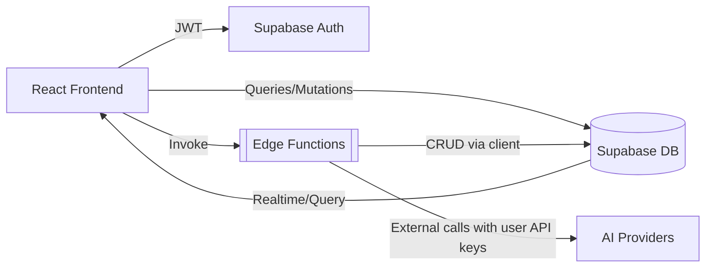

# Architecture & Data Flow Overview

This document provides a comprehensive, up‑to‑date view of the application’s architecture, security model, and the critical data flows (with diagrams) that power the platform.

## 1) System Overview

- Frontend: React 18 + TypeScript, Vite, Tailwind (design tokens), shadcn/ui, React Router v6, TanStack Query
- Backend: Supabase (PostgreSQL, Auth, Storage, Edge Functions, Realtime)
- AI Integrations: User-provided API keys only (OpenAI, Anthropic, Gemini, etc.) accessed server-side
- Observability: Audit logs, performance logs, cost tracking, health metrics



## 2) Frontend Architecture

- UI layer: feature-oriented components; semantic HTML; single H1 per page; accessible patterns
- State and data: TanStack Query (server state), React Context/Zustand (local/contextual state)
- Services/hooks:
  - Api Key Management: useApiKeyManager + ApiKeyManager service (single source of truth)
  - Competitor Analysis: service + hooks (fetch saved analyses, start runs, export)
- Routing: React Router v6, page-level SEO via react-helmet-async (title, meta, canonical)

Key page: SavedAnalysesPage – hub for listing, managing, and initiating analyses.

## 3) Backend Architecture (Supabase)

- Auth: JWT via Supabase Auth
- Database: PostgreSQL with Row Level Security (RLS) enabled broadly
- Storage: Buckets for documents and competitor assets
- Edge Functions: Serverless functions for secure operations needing secrets or server-only logic

### Core Tables (examples)
- api_keys: per-user encrypted provider keys, status, masked_key, key_hash, is_active
- competitor_analyses: canonical store for analysis outputs and metadata
- competitor_analysis_progress: session-based progress, status, percentages
- analysis_runs: generic run tracking (status, timing, errors)
- company_profiles: master profiles linked to analyses
- api_usage_costs: cost/tokens/endpoint tracking by user and provider
- audit_logs, performance_logs, system_health_metrics, realtime_subscriptions: observability

### Important DB Functions (selection)
- manage_api_key(operation, ...): insert/select/delete/get_for_decryption – enforces permissions
- insert_competitor_analysis_progress / update_competitor_analysis_progress / get_competitor_analysis_progress
- get_user_competitor_analyses(user_id?): secure list of a user’s analyses
- can_access_api_key, is_admin_user, get_user_role: security helpers used in RLS

### RLS Highlights
- Users can manage only their rows (e.g., api_keys uses can_access_api_key(user_id, auth.uid()))
- Admin/service-role bypasses for operational needs
- Timestamps managed by triggers – clients should not set them directly

## 4) Edge Functions

- competitor-analysis-gate: authorization/feature gating for running analyses
  - Inputs: Authorization (JWT), inferred user
  - Logic factors: global feature flag, user unlock state, active provider keys, optional cost checks
  - Current behavior: fail‑open on internal errors (always returns 200 with can_proceed=true on unexpected failures) to prevent blocking legitimate users

Note: Additional analysis/processing functions can be added as needed; all must use the Supabase client, respect RLS, and never execute raw SQL.

## 5) API Key Lifecycle (End‑to‑End)

```mermaid
sequenceDiagram
  participant UI as Settings UI
  participant Hook as useApiKeyManager
  participant DB as Supabase DB (manage_api_key)
  participant EF as Edge Function
  participant AI as Provider API

  UI->>Hook: saveApiKey(provider, key)
  Hook->>DB: rpc.manage_api_key('insert', masked_key, key_hash, ...)
  DB-->>Hook: {id, provider, masked_key, status}
  Note over DB: Raw key stored encrypted; masked_key returned to client

  UI->>EF: start analysis
  EF->>DB: rpc.manage_api_key('get_for_decryption')
  DB-->>EF: {provider, api_key (encrypted)}
  EF->>AI: Call provider using decrypted key
  AI-->>EF: Response
  EF->>DB: Persist results/costs/progress
  DB-->>UI: Realtime/queries update UI
```

Guarantees:
- No global keys for user operations; only per-user (or per-org) keys are used
- Raw keys never exposed to the browser

## 6) Competitor Analysis Data Flow

```mermaid
graph TD
  A[User: New Analysis] --> B[Frontend: service + form]
  B --> C{Gate Check
  (competitor-analysis-gate)}
  C -- can_proceed --> D[RPC: insert_competitor_analysis_progress]
  C -- cannot proceed --> Z[UI error + guidance]
  D --> E[Edge Function(s): orchestrate providers]
  E --> F[(DB: competitor_analyses)]
  E --> G[(DB: api_usage_costs)]
  E --> H[RPC: update_competitor_analysis_progress]
  F --> I[UI: list/detail]
  H --> I
```

Notes:
- Progress is session-based; UI can poll get_competitor_analysis_progress
- Results are persisted in competitor_analyses and surfaced via get_user_competitor_analyses
- Costs/tokens logged to api_usage_costs for per-user spend visibility

## 7) Security Model

- AuthN/AuthZ: JWT + RLS; admin checks via is_admin_user/get_user_role; dedicated policies for service_role
- Data isolation: All sensitive tables enforce user_id = auth.uid() (or helper) conditions
- API Keys: Access controlled via can_access_api_key; manage_api_key is SECURITY DEFINER to handle secure operations
- Edge Functions: Use Supabase client methods only; CORS enabled; never return raw keys

## 8) Observability & Reliability

- audit_logs: security-relevant events (API key CRUD, access)
- performance_logs: operation timings; slow op alerts feed system_health_metrics
- api_usage_costs: per-user, per-provider cost tracking (daily/date-based)
- system_health_metrics and get_system_health_overview(): admin dashboard health view
- analysis_runs + competitor_analysis_progress: operational telemetry for analysis runs

Reliability practices:
- Fail‑open gate for transient issues (prevents false negatives)
- maybeSingle() over single() where no-row is possible
- Defensive UI: empty states, retries, and structured error reporting

## 9) Deployment & Environments

- Frontend: Vite build; deploy via platform tooling (e.g., Vercel) or Lovable Publish
- Backend: Supabase project (DB, Auth, Edge Functions) – functions are auto-deployed with the repo
- Secrets: Configured in Supabase Function Secrets; never in client code; all providers are user‑scoped

## 10) Extensibility Guidelines

- Add features as modular slices (UI + service + types + tests)
- Define types in unified type modules; avoid any; keep strict Supabase response types in services/tests
- Always add RLS policies and SECURITY DEFINER RPCs for privileged workflows
- Document new flows with a Mermaid diagram in this file

## 11) Appendix – Key References

- API Keys: src/services/apiKeys + src/types/api-keys; RPC manage_api_key
- Competitor Analyses: src/pages/SavedAnalysesPage, types in src/types/competitor, RPCs for progress and retrieval
- Edge Function (gate): supabase/functions/competitor-analysis-gate
- Admin/Observability: audit_logs, performance_logs, api_usage_costs, get_system_health_overview()
