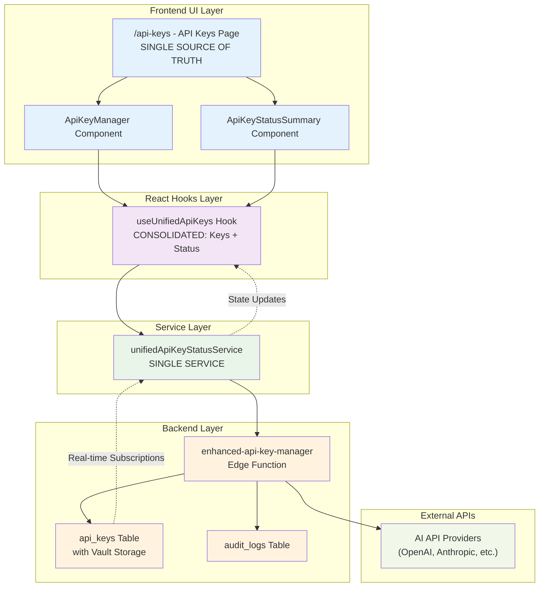

# Simplified API Key Management Architecture

## Overview
Consolidated API key management with single source of truth pattern, removing redundant services and hooks.

## Simplified Flow Diagram

## Key Simplifications Made

### Removed Redundancy
- ❌ `useUnifiedApiKeyStatus` hook → ✅ Merged into `useUnifiedApiKeys`
- ❌ `apiKeyService` legacy service → ✅ Direct use of `unifiedApiKeyStatusService`
- ❌ `ApiKeyContext` complexity → ✅ Simplified state management

### Consolidated Responsibilities
- **Single Hook**: `useUnifiedApiKeys` handles both keys and status
- **Single Service**: `unifiedApiKeyStatusService` manages all operations
- **Single UI Source**: `/api-keys` page is the authoritative interface

### Data Flow Benefits
1. **Linear Flow**: UI → Hook → Service → Backend
2. **Single Source of Truth**: All state managed in one place
3. **Real-time Updates**: Automatic propagation through unified subscriptions
4. **Type Safety**: Consistent types throughout the stack

## Component Responsibilities

### Frontend (`/api-keys` page)
- Display current API key status
- Manage API key creation/deletion
- Show real-time validation status

### Hook (`useUnifiedApiKeys`)
- Unified state management for keys and status
- Real-time subscriptions
- CRUD operations
- Status validation

### Service (`unifiedApiKeyStatusService`)
- Edge function communication
- Cache management
- Real-time notifications
- Validation coordination

### Backend (`enhanced-api-key-manager`)
- Vault encryption/decryption
- External API validation
- Database operations
- Audit logging

## Benefits of Simplified Architecture

1. **Reduced Complexity**: Single path for all operations
2. **Better Performance**: Fewer network calls, unified caching
3. **Easier Maintenance**: One service to update
4. **Type Consistency**: Unified type definitions
5. **Real-time Updates**: Single subscription system
6. **Security**: Centralized vault management