# Refactor Plan: /admin/master-profiles

This document defines a pragmatic, incremental, and testable plan to refactor and extend the Master Profiles admin feature. It follows the provided Core Beliefs, Process, Technical Standards, Quality Gates, and Single Source of Truth mandates.

Assumptions and constraints
- Authentication is via Supabase Auth; super admin users are identified by existing functions (is_super_admin / get_user_role).
- Per-user/org API keys only (no global keys); master profiles are built from user-triggered analyses and aggregated results.
- Existing components/services to reuse and extend:
  - Page: src/pages/admin/MasterCompanyProfiles.tsx and MasterCompanyProfileDetail.tsx
  - Services: MasterCompanyProfileService (existing), competitorAnalysisService
  - Edge Functions present in repo: aggregate-analysis, bulk-consolidate-companies (logs exist)

Key outcomes
- Super admin view of all master company profiles
- Feature flags (global, org, user) for master profile functionality
- Dynamic flow visualization with health status and pinpointed failure location
- Real-time search-as-you-type for profiles
- Detail view overlay with admin insights: confidence, sources, run counts, field update counts, audit log
- Edit with full audit + rollback to previous versions

Plan overview (5 stages)

Status Board
- Stage 1: Complete
- Stage 2: Complete
- Stage 3: In Progress (≈10%)
- Stage 4: Not Started
- Stage 5: Not Started

## Stage 1: Foundations — Types, Services, and Data model
Goal: Establish clear types, service boundaries, and DB design (migrations to be proposed separately) without breaking existing behavior.
Success Criteria:
- New interfaces for Master Profile, AuditEntry, Snapshot, FeatureFlag, FlowEvent, and effective feature state
- Service contracts defined: FeatureFlagService, FlowMonitorService, MasterProfileAuditService, MasterProfileSnapshotService
- No behavior regressions; existing pages compile and tests remain green
Tests:
- Unit: Type conformance tests for services (using TS and basic runtime assertions)
- Unit: Ensure competitorAnalysisService and MasterCompanyProfileService imports remain intact
Scope of Changes (code):
- Create src/types/admin/master-profiles.ts (single source of truth for admin-side types)
- Create service interfaces with minimal stubs (no side effects):
  - src/services/featureFlagService.ts
  - src/services/flowMonitorService.ts
  - src/services/masterProfileAuditService.ts
  - src/services/masterProfileSnapshotService.ts
- Document DB requirements in this plan; actual migrations deferred to Stage 2/3/5

## Stage 2: Feature Flags — Global/Org/User targeting with secure RLS
Goal: Enable super admin to toggle master profile features globally, per organization, and per user; compute effective flag on read.
Success Criteria:
- Super admin UI can: create flag, toggle global, add org override, add user override
- Client API only reads “effective” flag via a single RPC with strict RLS; non-admins can only read effective state for themselves
- All writes audited (who, when, what)
Tests:
- Unit: FeatureFlagService.computeEffectiveFlag precedence: user > org > global > default
- Integration: RLS enforces that non-admin cannot write; super admin can write
- E2E: Toggle flag on/off and verify UI respects it
DB Design (proposed):
- Table: feature_flags(id uuid pk, flag_key text unique, description text, default_enabled bool, created_at, updated_at)
- Table: feature_flag_overrides(id uuid pk, flag_id uuid fk, scope_type text check in ('global','organization','user'), scope_id uuid null, enabled bool, created_at, updated_at)
- Table: feature_flag_audit(id uuid pk, actor_id uuid, action text, flag_id uuid, details jsonb, created_at)
- RPC: get_effective_feature_flag(flag_key text, user_id uuid default auth.uid()) returns (enabled boolean, source text)
- RPC: set_feature_flag(flag_key text, scope_type text, scope_id uuid, enabled bool) SECURITY DEFINER, admin-only
- RLS: read allowed; writes restricted to super admin/service role
UI:
- New Admin panel section in /admin/master-profiles: “Feature Flags” with tabs: Global, Organization, User
- Reuse existing Admin layout patterns and design tokens; no hardcoded colors

Completion Update (2025-08-10):
- Reads via rpc('get_effective_feature_flag') implemented in FeatureFlagService (isFeatureEnabled) ✅
- Writes via rpc('set_feature_flag') with scope support (global/org/user) implemented ✅
- Admin UI supports scope selection, org picker via rpc('get_user_organizations'), per-scope toggling, and create-flag flow ✅
- Unit tests added for org/user scope updates and RPC-fallback path ✅
- Status: Complete

## Stage 3: Flow Monitoring & Visualization
Goal: Show a live, clickable flow from user API calls through provider runs, normalized results, aggregation, and master profile updates. Highlight broken segments with exact failing component/function.
Success Criteria:
- A diagram (using @xyflow/react) displaying nodes: User -> Edge/Function Gate -> Provider Runs -> Provider Results -> Aggregation -> Master Profile -> Detail View
- Live status indicators per node: ok/warn/error with tooltips and deep links
- On error, display where it failed and last error message (e.g., edge function name + error excerpt)
Tests:
- Unit: FlowMonitorService maps database/edge logs to node statuses
- Integration: Simulate a provider failure and verify error node highlights
- E2E: Trigger backfill, observe nodes turning green as stages complete
DB/Observability (proposed):
- Table: flow_events(id, user_id, analysis_id, company_profile_id, stage text, status text, component text, error text, metadata jsonb, created_at)
- Source data: analysis_provider_runs/results, analysis_combined, audit_logs, function_edge_logs (queried via analytics endpoint)
- RPC: get_flow_overview(company_profile_id uuid, since timestamptz) returning per-stage aggregates
- Realtime channel: optional enhancements for streaming updates
UI:
- Component: AdminFlowDiagram using @xyflow/react with semantic tokens; click node => show details pane (latest events, errors, counts)
- Badge variants driven by status, consistent with design system
Progress Update (2025-08-10):
- Implemented minimal FlowMonitorService.getOverviewByAnalysisId with status computation ✅
- Added unit tests for computeOverallStatus ✅
- Created Admin FlowDiagram component (semantic, placeholder for @xyflow) ✅
- Next: wire to page and expand to realtime logs ⏳

## Stage 4: Search & List — Real-time search-as-you-type with debounced queries
Goal: Fast, accurate, real-time search of master profiles with as-you-type results.
Success Criteria:
- Debounced client-side input (250ms) => server-side RPC with indexed search
- Results sorted by relevancy and recent updates
- No visible jank under 200ms perceived latency for small datasets; scalable with indexes
Tests:
- Unit: Debounce and query param shaping
- Integration: RPC returns expected results and honors RLS
- E2E: Typing filters results immediately; clicking result opens detail
DB (proposed):
- Ensure master_company_profiles exists with indexes:
  - GIN/trigram on company_name, website_url
- RPC: search_master_profiles(term text, limit int default 20)
UI:
- Replace ad-hoc calls with Search service method; keep existing UI feel
- “No results” state adheres to design tokens

## Stage 5: Detail View — Admin overlay, edit, audit, and rollback
Goal: Enrich detail view with admin-only overlays, allow edits with full audit, and support rollback to previous versions.
Success Criteria:
- Detail view shows: overall confidence, source providers, number of analyses contributing, per-field update count
- Admin can edit fields; every edit logs to audit table and creates a versioned snapshot
- Rollback: list snapshots (last 30 days in DB) and restore selected; older snapshots optionally archived to Supabase Storage (JSON)
Tests:
- Unit: Snapshot create/restore logic
- Integration: Editing updates profile, creates audit + snapshot entries; RLS enforced; restore works
- E2E: Edit a field, see audit entry and ability to rollback successfully
DB (proposed):
- Table: master_profile_audit(id, profile_id, actor_id, change_set jsonb, created_at)
- Table: master_profile_snapshots(id, profile_id, version int, snapshot jsonb, created_at)
- Trigger: before update on master_company_profiles => write snapshot; keep 30 days
- Edge Function (optional): archive_old_snapshots using Storage; scheduled via cron
UI:
- Components: AdminDetailOverlay, AuditTimeline, SnapshotRollbackDialog
- Respect design tokens; no direct colors

Testing strategy
- Unit tests (jest) for services and helpers (src/__tests__/unit/admin/*)
  - Note: In test files use `import type { PostgrestResponse } from '@supabase/supabase-js'` per project rules
- Integration tests (jest + msw): RPC calls, RLS expectations via mocked responses
- E2E (Playwright):
  1) Feature flag toggling affects page content
  2) Flow diagram shows provider failure and recovery
  3) Search-as-you-type returns results
  4) Detail overlay shows metrics; edit + rollback works

Security & RLS
- Feature flags: read allowed to authenticated; writes allowed only to super admin/service role; audits for all writes
- Flow events: users see their own; admins see all
- Master profiles: read for admins; edits only for admins; all edits audited + snapshot
- Follow existing pattern to avoid recursion in RLS via SECURITY DEFINER functions

Performance & DX
- Indexed search columns; keep payloads small via selected columns
- Debounce inputs; lazy-load detail overlay data
- Strict TypeScript types (no any); unified types in src/types/admin/master-profiles.ts
- Maintain single source of truth for services and shared logic

Rollout & staging
- Stage behind the master_profiles feature flag (global default off, admin-only visible)
- Ship Stage 2 first (flags), then Stage 3 (flow), Stage 4 (search improvements), Stage 5 (detail admin capabilities)
- Add observability (performance logs, flow_events) to validate each stage

Definition of Done checklist
- [ ] All new unit/integration/e2e tests written and passing
- [ ] No linter/formatter warnings
- [ ] RLS policies validated for all new tables
- [ ] RPCs avoid leaking data across users; use auth.uid() consistently
- [ ] UI uses design system tokens; responsive; accessible
- [ ] Documentation comments added to all services/components
- [ ] No regressions: existing MasterCompanyProfiles functionality intact

Appendix A — Proposed SQL (to be executed via migration tool after approval)
Note: Pseudocode-level; actual migration will include full DDL, RLS, indexes, triggers, and comments.

- feature_flags / feature_flag_overrides / feature_flag_audit tables + RPCs
- flow_events table + indexes on (analysis_id, profile_id, stage, created_at)
- search_master_profiles and get_effective_feature_flag RPCs
- master_profile_audit and master_profile_snapshots tables + snapshot trigger
- Optional: scheduled edge function to archive snapshots older than 30 days to Storage

Appendix B — Components & Files to add (single source of truth)
- src/types/admin/master-profiles.ts
- src/services/featureFlagService.ts
- src/services/flowMonitorService.ts
- src/services/masterProfileAuditService.ts
- src/services/masterProfileSnapshotService.ts
- src/components/admin/master-profiles/FeatureFlagControls.tsx
- src/components/admin/master-profiles/FlowDiagram.tsx (uses @xyflow/react)
- src/components/admin/master-profiles/AdminDetailOverlay.tsx
- src/components/admin/master-profiles/AuditTimeline.tsx
- src/components/admin/master-profiles/SnapshotRollbackDialog.tsx
- Tests under src/__tests__/(unit|integration|e2e)/admin/master-profiles/*

Appendix C — Visual reference (flow)

```mermaid
flowchart LR
  A[User analysis request] --> B[Edge: competitor-analysis-gate]
  B --> C[Edge: competitor-analysis]
  C --> D[(analysis_provider_runs)]
  D --> E[(analysis_provider_results)]
  E --> F[Edge: aggregate-analysis]
  F --> G[(analysis_combined)]
  G --> H[(master_company_profiles)]
  H --> I[Admin Detail View]

  classDef ok fill:#22c55e,stroke:#15803d,color:#fff
  classDef warn fill:#f59e0b,stroke:#b45309,color:#fff
  classDef err fill:#ef4444,stroke:#991b1b,color:#fff
```

Notes
- We will not remove or replace existing functionality; all additions are additive and behind flags where appropriate.
- All code will include robust comments and adhere to the project’s design tokens and TypeScript strictness.
- We will prefer RPCs and triggers over CHECK constraints for time-based or mutable validations.

---

API Remediation & Hardening (Consolidated)

Consolidated Goals & KPIs
- No permission denied errors in client logs (RLS-safe access only)
- All edge functions operational with clear degraded reasons
- Per-user and per-organization API keys only; no global secrets for user work
- Competitor analyses persist and are visible in UI
- Admin Debug Report aggregates tab errors and copies cleanly
- KPIs: Health checks ≥ 99%, 0 PII leaks, < 1% error rate, 100% unit/integration pass

Progress Tracker
- Completed tasks / Total tasks = Percentage
- Current: 20 / 96 tasks (21%)
- Stream summary: provider runs/results/combined with RLS; aggregate-analysis EF; UI reads combined; metrics pipeline stable

Cross‑plan Integration Map
- Stage 2 (Feature Flags) ↔ Remediation §2/§7: RLS-safe RPCs and JWT-verified EFs; flags gate visibility and rollout
- Stage 3 (Flow Viz) ↔ Remediation §3/§4/§5: microservice health + competitor analysis persistence + admin diagnostics
- Stage 4 (Search) ↔ Remediation §2: RLS-compliant RPC-based search with proper indexing
- Stage 5 (Detail/Audit/Rollback) ↔ Remediation §2/§4: audited writes, snapshots, and verified RLS paths
- Types/Testing ↔ Remediation §6/§8/§10: strict TS, PostgrestResponse in tests, full checklist

Global Remediation Tasks (adopted verbatim with minor formatting)
1) Edge Functions: Key Management & Validation
- decryptIfNeeded helper per EF (no cross-file imports); tolerate base64/plain
- Standard key fetch via RPC manage_api_key('get_for_decryption'); admin-only explicit key path for diagnostics
- Input validation per EF; consistent corsHeaders, OPTIONS; per-request Supabase client with Authorization header
- Error mapping by provider; log to api_metrics with request_id; verify_jwt true for protected fns
- Admin API keys access via service role EF or SECURITY DEFINER RPC; gate by is_admin_user

2) Database Access & RLS Compliance
- Replace direct reads on restricted tables with curated RPCs or service-role EFs
- DB liveness probe via rpc('debug_auth_context') instead of restricted tables
- Validate RLS: ensure user_id present on writes; add SELECT via SECURITY DEFINER RPCs where needed

3) Microservice Health Monitor
- Source URLs from public.microservices; degrade gracefully; throttle; store last_success
- Persist metrics to api_metrics for trends

4) Competitor Analysis Data Flow
- On completion, ensure competitor_analyses finalized (status, analysis_data, actual_cost, completed_at, data_quality_score)
- Use progress RPCs; enforce RLS-safe writes; idempotency by (session_id,user_id) with retry

5) Admin UI Enhancements (Debug/Integration Map)
- Core DB probe uses rpc('debug_auth_context')
- Issues summary + tab_error_details retained; “Copy for AI” everywhere; deep links to function logs

6) Build/Quality Hygiene
- Replace deprecated import.meta.glob options
- Type rules: tests import type PostgrestResponse; services use PostgrestResponseSuccess; mocks complete; no any
- Expand EF unit tests for payload validation & key handling

7) Verification & Rollout
- Phased rollout; feature flags per function/version
- Verification matrix: health, key validation, analysis visibility, debug report completeness
- Rollback path via flags and preserved EF versions

8) Task Board (Checklist)
A. Plan Initialization
- [x] Capture approvals (EF scopes, SECURITY DEFINER RPCs, metrics, providers, auth, idempotency, alerts, deps, tracker)
- [x] Compile Edge Function inventory

B. Edge Function Inventory Audit (Criteria apply to all: CORS+OPTIONS, verify_jwt, per-request client, no raw SQL, standardized errors, api_metrics logs, input validation, manage_api_key)
- [ ] ai-chat
- [ ] ai-cofounder-chat
- [ ] ai-profile-setup
- [ ] analyze-trends
- [ ] admin-api (if present)
- [ ] admin-api-keys
- [ ] api-key-management
- [ ] api-key-validation
- [ ] check-api-keys
- [ ] code-embeddings
- [ ] code-wiki
- [ ] competitor-analysis
- [x] aggregate-analysis
- [ ] database-optimizer
- [ ] database-schema
- [ ] enrich-analysis-with-master-profile
- [ ] get-anthropic-usage
- [ ] get-cohere-usage
- [ ] get-function-url (public)
- [ ] get-gemini-usage
- [ ] get-mistral-usage
- [ ] get-openai-usage
- [ ] get-perplexity-usage
- [ ] github-code-embed
- [x] log-api-metric
- [ ] microservice-health
- [ ] microservices
- [ ] package-manager
- [ ] process-application-embeddings
- [ ] process-code-embeddings
- [ ] process-document
- [ ] prompt-get (public)
- [ ] secure-embeddings-api (public)
- [ ] secure-openai-chat
- [ ] semantic-code-search
- [ ] set-super-admin
- [ ] swagger-ui (public)
- [ ] system-health
- [ ] type-coverage-analysis
- [ ] validate-api-key
- [ ] populate-master-profiles

C. Metrics Store (api_metrics)
- [x] Validate schema, indexes, and RLS; ensure EF logging path
- [ ] Tests: insert/select policies; basic aggregations

D. Providers Coverage & Toggles
- [ ] Consolidate provider toggle source of truth; supported: openai, anthropic, gemini, cohere, mistral, perplexity, groq (extensible)
- [ ] Orchestration respects toggles and org-first preference
- [ ] Tests for selection and fallback

E. Alerts & Notifications
- [ ] Choose channel (e.g., Slack) & secret; admin-only EF to send alerts; wire critical paths

F. Competitor Analysis Persistence & Idempotency
- [ ] Finalize writes; use progress RPCs; RLS checks; idempotency + retries; E2E validation

G. Dependency Hygiene
- [ ] Security audit and patch/minor updates; lock versions; run full tests; update CHANGELOG

H. Quality Hygiene & Types
- [ ] Replace import.meta.glob options; enforce TS rules above; expand unit tests

9) Links
- Edge Functions: https://supabase.com/dashboard/project/jqbdjttdaihidoyalqvs/functions
- Logs: see function-specific links (validate-api-key, check-api-keys, competitor-analysis, microservice-health, etc.)
- SQL Editor: https://supabase.com/dashboard/project/jqbdjttdaihidoyalqvs/sql/new

10) Development Guidelines (Mandatory)
- Core beliefs, simplicity, process, technical standards, code quality, error handling, decision framework, integration, tooling, quality gates, test guidelines, reminders (as specified in the remediation plan).
- Tests in this repo must import type PostgrestResponse in test files; avoid any; complete mocks.
- Per-user/org keys only; never use global keys for user operations.

End of consolidated plan.

