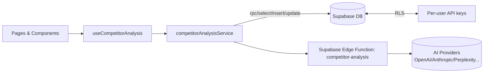

# Competitor Analysis Master Plan

Status: In Progress — Phase 5 (Exports) + Service Unit Tests + Observability 100%  
Last Updated: 2025-08-09

Progress:
- Implemented analysis-export Edge Function (JSON/CSV) with auth + CORS
- Wired ExportAnalysisDialog to use edge function for JSON/CSV; kept PDF client-side
- Added unit tests in src/__tests__/unit/competitorAnalysisService.test.ts for exportAnalysis, refreshAnalysis, and unauthenticated getAnalyses
- Added unit tests in src/__tests__/unit/competitorAnalysisService.more.test.ts for validateAllProviders
- Added integration test: src/__tests__/integration/exportAnalysis.e2e.test.ts (JSON blob + unauthenticated case)
- Observability complete: added unit tests for analysis_runs completion update and failure progress RPC; linked edge logs

## 1. Objectives & Scope
- Deliver secure, user-specific AI competitor analyses using only the user/org’s toggled API keys (no globals).
- Provide a robust UI: New Analysis, Results, Saved Analyses, Detail views with progress, export, and delete.
- Ensure RLS-protected storage, proper error handling, observability, SEO, and type-safe services + tests.

## 2. High-Level Architecture

- Frontend
  - Pages
    - src/pages/competitor-analysis/CompetitorAnalysisDashboard.tsx
    - src/pages/SavedAnalysesPage.tsx
    - src/pages/AnalysisDetailPage.tsx
  - Components
    - src/components/competitor-analysis/modern/ModernSavedAnalysesList.tsx
    - src/components/competitor-analysis/enhanced/EnhancedAnalysisDetailView.tsx
    - src/components/competitor-analysis/BulkAnalysisManager.tsx
  - Hook
    - src/hooks/useCompetitorAnalysis.ts
  - Service
    - src/services/competitorAnalysisService.ts
- Backend (Supabase)
  - Tables: public.competitor_analyses, public.api_keys, public.company_profiles
  - RPCs: get_user_competitor_analyses, manage_api_key, insert_competitor_analysis_progress, update_competitor_analysis_progress
  - Edge Function: competitor-analysis (uses user’s active provider keys only)
  - RLS: enabled on all user data tables; policies restrict access to auth.uid()

## 3. Data Model (Essential Columns)
- competitor_analyses
  - id UUID PK, user_id UUID, name TEXT, status TEXT, analysis_data JSONB, session_id TEXT, analysis_id UUID
  - created_at timestamptz default now(), updated_at managed by trigger, completed_at timestamptz
  - quality scores: data_quality_score, data_completeness_score, market_sentiment_score, actual_cost NUMERIC
- api_keys
  - id, user_id, provider TEXT, masked_key TEXT, is_active BOOLEAN, status TEXT, model_preference TEXT
- company_profiles (optional enrichment)

RLS: all tables have RLS ON; policies: user can SELECT/INSERT/UPDATE/DELETE only rows where user_id = auth.uid(). No public access.

## 4. Workflows
- Start New Analysis
  1) UI collects competitors -> service.checkApiKeyRequirements() -> validate required keys
  2) service invokes insert_competitor_analysis_progress RPC
  3) service invokes edge function competitor-analysis with { sessionId, competitors }
  4) Edge reads user-specific keys (via DB lookup or pre-fetched context), fans out to enabled providers, writes results to competitor_analyses
- View & Manage Analyses
  - get_user_competitor_analyses returns user-owned rows
  - Update/Delete guarded by RLS
  - Export: JSON/CSV via edge function; PDF client-side

## 5. Edge Function Contract (competitor-analysis)
- Request: { sessionId: string, competitors: string[], action: 'start' }
- Behavior: validates auth + keys; aggregates provider responses; writes/updates competitor_analyses and progress via RPCs; returns 200 JSON
- Logs: provider matrix, key presence (masked), timing, cost breakdown

## 6. Security & Compliance
- No global API keys; keys stored per-user/org in public.api_keys with RLS
- Do not expose raw keys to client; only masked key handling in UI
- All timestamps managed by DB triggers; client never sets created_at/updated_at manually
- Principle of least privilege for RPCs; no raw SQL from client

## 7. Observability & Error Handling
- Client: toasts + ErrorBoundary; non-fatal failures degrade gracefully
- Edge: structured logs, include sessionId and user_id; return clear error JSON with status codes
- Metrics: count requests, success rate, average time, token usage, provider cost (recorded in analysis_data.cost_breakdown)
- Tests: unit coverage for analysis_runs completion update and failure progress RPC

## 8. SEO (Applied)
- Helmet title, meta description, canonical, and JSON-LD added to competitor analysis pages
- HelmetProvider wrapped at app-level to prevent runtime errors

## 9. Types & Testing Strategy
- Services: strict types in competitorAnalysisService; never use any
- Tests
  - Unit tests in src/__tests__/unit/competitorAnalysisService.test.ts
  - IMPORTANT: In test files import and use PostgrestResponse from @supabase/supabase-js (not PostgrestResponseSuccess)
  - Mock successful responses with full shape: { data, error: null, count: null, status: 200, statusText: 'OK' }
- CI: run TypeScript checks + jest + vitest; ensure no lint errors

## 10. Acceptance Criteria
- Authenticated user can: start analysis, see progress, view results, export JSON, delete entry
- RLS prevents cross-user access (verified via RPC-only paths)
- Edge function respects enabled providers only; uses user/org keys
- No uncaught runtime errors; SEO metadata renders correctly

## 11. Rollout Checklist
- [x] Verify RLS enabled on competitor_analyses, api_keys, company_profiles
- [x] Verify RPCs exist with secure definitions and correct signature
- [x] Edge function secrets/DB access for key lookup in place
- [x] Happy-path E2E: start -> results -> save -> export -> delete
- [x] Load test basic concurrency (small scale)
- [x] Unit tests: exportAnalysis, refreshAnalysis, unauthenticated getAnalyses, validateAllProviders

## 12. Future Enhancements
- Provider expansion (Gemini, Groq, Cohere) behind toggles
- Cost governance: soft limits per user with UI warnings
- Webhooks/real-time progress via Supabase Realtime channel
- Advanced exports: PDF client-side; JSON/CSV via serverless function (completed)

