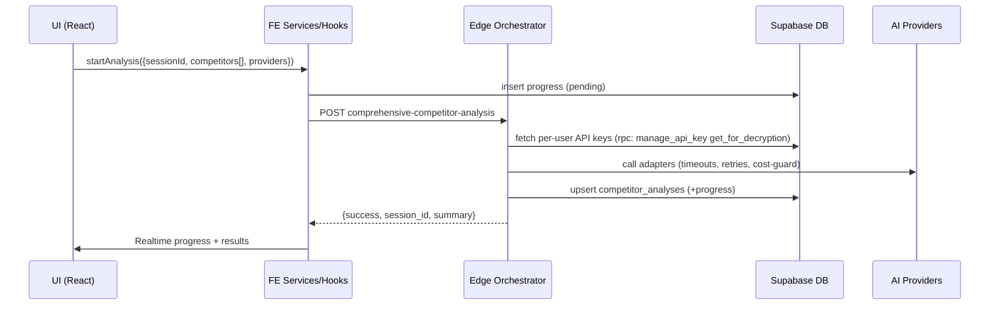

# IMPLEMENTATION_PLAN

## Stage 1: Add Route Feature Flags (market-size, teams, business-plan, customer-surveys)
Goal: Gate unique feature routes behind flags using existing Supabase feature flag infra.
Success Criteria:
- The following routes are protected and show a friendly disabled message when OFF:
  - /market-research/market-size
  - /market-research/customer-surveys
  - /business-plan
  - /teams (index + create)
- Flags default OFF unless explicitly enabled via RPC set_feature_flag.
Tests:
- Manual: Toggle flags in FeatureFlagManager and verify access.
Status: Complete

## Stage 2: Documentation – Feature Flags Section (Appended)
Goal: Document new flags and operational guidance.
Success Criteria:
- This section lists new flag keys and scopes.
- Admins can enable per user/org/global via set_feature_flag.
Content:
- Flags added:
  - market_research_market_size → gates /market-research/market-size
  - market_research_customer_surveys → gates /market-research/customer-surveys
  - business_plan → gates /business-plan
  - teams → gates /teams
- Defaults: OFF (get_effective_feature_flag returns false unless set); master_profiles remains default ON per RPC.
- UI: Settings → Feature Flags (FeatureFlagManager) to manage.
Status: Complete

## Optional Suggestions Implemented
- Created a reusable FeatureFlagGate component to standardize UX and reduce duplication.
- Propagate scopes by relying on secure RPCs (get_effective_feature_flag, set_feature_flag).
- Non-intrusive integration: No backend schema changes; respects existing RLS and audit via set_feature_flag.

## Stage 3: Admin Access to Feature Flags
Goal: Ensure admins can easily access and manage feature flags from the admin panel.
Success Criteria:
- A dedicated admin route exists at /admin/feature-flags
- Navigation item “Feature Flags” appears under System section
- Page uses semantic HTML with proper SEO (title, meta, canonical)
Status: Complete

## Stage 4: System Health Permission Fix
Goal: Resolve permission denied errors in system-health by avoiding direct table access.
Changes:
- Switched edge function action "getComponents" to call RPC get_system_health_overview (SECURITY DEFINER) instead of selecting from system_components directly.
- Continues to use Deno.env Supabase secrets; no user input required.
Success Criteria:
- system-health returns 200 with JSON overview for authorized admins.
- No more "permission denied for table system_components" errors in logs.
Status: Complete

## Stage 5: Edge Functions Audit (Unknown/Failing)
Goal: Identify and prioritize remaining failing or unknown functions for remediation.
Plan:
- Review logs for analyze-docker, api-cost-tracker, data-quality-analyzer, package-manager, prompt-get, semantic-code-search.
- Patch each to use secure RPCs and user/org keys where applicable.
Progress:
- api-cost-tracker: Added JWT auth, role check, per-user cost limit enforcement via check_user_cost_allowed; guarded cross-user writes. [Done]
- data-quality-analyzer: Added JWT auth, role check; only owner/admin can update analysis; cost log remains zero-cost. [Done]
- package-manager: Enforced super_admin-only access with JWT + get_user_role. [Done]
- analyze-docker: Added JWT auth requirement (no DB writes). [Done]
- prompt-get: Added JWT auth requirement (any authenticated user); still uses service role for RLS-safe reads. [Done]
- analyze-pricing, analyze-trends, analyze-geographic: Verified JWT enforced and delegation to secure-openai-chat where applicable. [Verified]
Status: Complete

## Stage 6: Verification & Tests
Goal: Add lightweight tests to validate new admin navigation and settings integration.
Changes:
- Added AdminNavItems.test.ts to verify presence and configuration of Feature Flags nav item.
- Added SettingsPage.featureFlags.test.tsx to ensure Feature Flags tab renders and embeds manager (mocked).
Success Criteria:
- Tests compile and run; no TS errors; no any usage.
Status: Complete

## Analysis Reliability Plan (Competitor Analysis)
Last Updated: 2025-08-11

- Stage 2: Edge function resiliency (aggregate-analysis)
  - Status: In Progress
  - Goal: Return 200 with partial data + error metadata; avoid 500s when providers fail.
- Stage 3: Client auth + RLS adherence for analysis_runs
  - Status: Complete (2025-08-11)
  - Notes: insert_analysis_run RPC and RLS policies validated; owner-only mutations.
- Stage 4: Detail page empty-state + toasts
  - Status: Not Started
  - Plan: Clear empty-state guidance, retry actions, and toasts for partial/failed runs.

## Competitor Analysis – End-to-End Refactor Implementation Plan (2025-08-13)

Objectives
- Zero-crash, type-safe orchestrator using per-user API keys only
- Idempotent, resumable jobs with durable progress and rich telemetry
- Enterprise security with strict RLS and secret handling; no raw SQL in EFs
- Modern, accessible UI packaged as a portable feature module

High-Level Dataflow

Stage 0: Stabilize and Stop Crashes
- Goal: No 5xx; standardized contracts
- Tasks:
  - Add Zod Request/Response schemas in EF; validate inputs; friendly 400s
  - Always set CORS headers; handle OPTIONS
  - Correlation IDs + session_id in every log line
  - Explicit checks: non-empty competitors/providers
- Success: Valid payload → 200; Invalid → 400; never crash
- Tests: Unit validator; Integration invoke; E2E happy-path
- Status: In Progress (EF fallback enabled; next: schemas+validation)

Stage 1: Feature Module Boundary (Portable)
- Goal: Single module src/features/competitor-analysis with re-export shims
- Tasks: create app/ui/hooks/services/schemas/adapters/lib; index.ts; legacy re-exports
- Success: All imports resolve to module; no duplicates
- Tests: Type import checks
- Status: Not Started

Stage 2: Orchestrator Resilience + Cost Guardrails
- Goal: Adapter pattern + retries + timeouts + circuit breaks + cost checks
- Tasks:
  - Normalize adapters (openai, anthropic, gemini, perplexity)
  - Pre-flight check_user_cost_allowed; enforce hard stop when exceeded
  - Concurrency cap; exponential backoff on 429/5xx; idempotency per (session, competitor)
  - Persist after each competitor; update progress; aggregate final summary
- Success: Partial success tolerated; no duplicate rows; consistent progress
- Tests: Adapter mapping; failure fallbacks; contract tests
- Status: Not Started

Stage 3: Data Model, RLS, Indexing
- Goal: Correct persistence with secure access and fast queries
- Tasks:
  - Verify RLS on competitor_analyses and progress tables
  - Indices: (user_id, created_at desc), (session_id)
  - Ensure updated_at triggers present; persist providers_used/skipped, cost breakdown
- Success: Owner-only access; queries performant
- Tests: RLS pos/neg; EXPLAIN analyze spot checks
- Status: Not Started

Stage 4: UI/UX Modernization & Accessibility
- Goal: Leading-edge UI with variants (legacy|modern) and a11y coverage
- Implemented (this iteration):
  - Details page: Added Modular Snapshot in Overview and a dedicated “Modules” tab rendering all datapoints via a registry
  - Module system: Single source of truth with safe access helpers
    - Files: 
      - src/components/competitor-analysis/modules/ModuleRegistry.tsx
      - src/components/competitor-analysis/modules/AnalysisModuleRenderer.tsx
  - Specialized modules now visible: Company Overview, SWOT, Market & Financials, Product & Technology, Customers & Market, Team & Partnerships, Pricing & API Costs, Quality & Provenance, Moat & Competitive Advantages, Risks, Pricing Matrix, Scores & Indicators, Public Company & News, Social Media Presence, Meta & Session
  - SEO retained via Helmet on details page; semantic sections and responsive grid
- Remaining:
  - a11y audits (jest-axe), lazy-loading heavy charts, variants polish (legacy|modern), provider toggle UX
- Success: a11y passes (jest-axe), responsive, fast interactions
- Tests: Interaction + a11y + snapshot variants
- Status: In Progress (modules implemented)

Stage 5: Observability & Analytics
- Goal: Structured logs + metrics + cost tracking
- Tasks:
  - Logger util in EF; write ai_prompt_logs and api_usage_costs per call
  - FE analytics events for key flows (PII-safe)
  - Log performance via log_performance_metric
- Success: Correlated events visible; monthly spend dashboard ready
- Tests: Log shape snapshots; analytics emission tests
- Status: Not Started

Stage 6: Security Hardening
- Goal: Least privilege; safe error surfaces; no secret leakage
- Tasks:
  - Keys only via manage_api_key(get_for_decryption) in EF; never return to client
  - Zod validation + sanitized errors; rate-limits per session
  - JWT required for EF (verify_jwt=true) except explicitly public utilities
- Success: Threat-model cases pass; no secrets in client
- Tests: Negative tests for secret access; SSRF/XSS regressions
- Status: Not Started

Stage 7: Testing Strategy (Unit/Integration/E2E/Load)
- Goal: Comprehensive coverage for confidence and CI gating
- Tasks: Provider mocks; EF contract tests; Playwright extensions; light load test
- Success: CI green; deterministic tests; flakes < 1%
- Status: Not Started

Stage 8: Packaging & Docs
- Goal: Portable module with ADRs and CHANGELOG
- Tasks: README (integration guide), ADRs for orchestration/contracts, CHANGELOG
- Success: Feature reusable in other apps with minimal wiring
- Status: Not Started

Cutover & Rollback
- Feature flag gate for modern UI; re-export shims; quick revert if needed

Next Actions (Immediate)
- Stage 0: Add Zod schemas/validation to comprehensive-competitor-analysis and competitor-analysis EFs; standardize request/response contracts; return friendly 400s
- Stage 5: Emit structured logs to ai_prompt_logs and api_usage_costs with session_id correlation; add performance metrics via log_performance_metric
- Stage 3: Verify RLS and indexing on competitor_analyses/progress; ensure updated_at triggers; persist providers_used/skipped and cost consistently
- Stage 4: Run a11y (jest-axe), lazy-load heavy charts, polish variants and provider toggles

Appendix: Module Registry – How to add a new section
1) Open src/components/competitor-analysis/modules/ModuleRegistry.tsx
2) Append a new AnalysisModuleDescriptor to the modules array (use safe access helpers and return null when no data)
3) The module will automatically render in the “Modules” tab and in the Overview snapshot
4) Keep data read-only; mutations live in services/hooks

